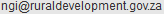

# gmza10: Global Map South Africa 1.0
## non-commercial use

## commercial use
  

## note
Credit: "Global Map of the Republic of South Africa © ISCGM/State Copyright, Department of Rural Development and Land Reform, Chief Directorate of National Geo-spatial Information, Website: http://www.ngi.gov.za/"

Contact: Department of Rural Development and Land Reform, Chief Directorate of National Geo-spatial Information. 

E-mail: 

URL: http://www.ngi.gov.za/
